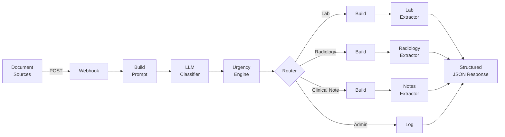
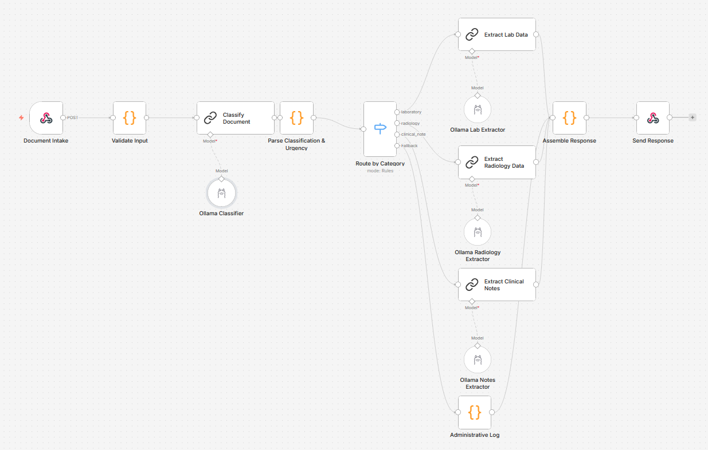

# Clinical Document Router

[](https://n8n.io)
[](https://ollama.com)
[]()
[](LICENSE)

Automated classification, data extraction, and intelligent routing of clinical documents using n8n workflow automation and Large Language Models — fully on-premise for healthcare data privacy compliance.

> **Disclaimer:** This is a demonstration project for educational and portfolio purposes. It is not a medical device and has not been validated for clinical use. See [DISCLAIMER.md](DISCLAIMER.md) for details.

## The Problem

Hospitals receive hundreds of clinical documents daily from multiple sources — lab results, radiology reports, discharge notes, prescriptions, administrative forms. In many healthcare settings:

- Documents arrive mixed from scanners, email, fax, and patient portals
- Staff manually classifies each document before filing in the EHR
- Clinically critical results (e.g., dangerous lab values) can sit unnoticed for hours
- Time spent on document management is time taken from direct patient care

## The Solution

This n8n workflow automates the document pipeline:

1. **Classify** — An LLM identifies the document type and generates a structured summary
2. **Assess Urgency** — A deterministic rules engine evaluates clinical urgency (not the LLM — see [Architecture](docs/architecture.md#4-urgency-engine-code-node--rules-based))
3. **Extract** — Specialized prompts pull structured data based on document type
4. **Route** — Documents reach the appropriate destination; critical values trigger immediate alerts





## Document Categories

| Category | Extraction | Alert Level |
|----------|-----------|-------------|
| Laboratory (critical values) | Patient, tests, values, reference ranges, flags | Immediate |
| Laboratory (normal) | Same extraction, no alert | Standard |
| Radiology | Modality, body region, findings, impression | Priority |
| Clinical notes / Discharge | Diagnoses, medications, follow-up, warning signs | Priority |
| Interconsultation | Requesting/consulted service, reason, clinical question | Priority |
| Administrative | Document type, date (no LLM processing) | Low |

## Key Design Decisions

### Hybrid AI + Rules for Safety

Critical value detection uses **deterministic regex rules**, not LLM inference. The LLM classifies documents (what it does best); the rules engine evaluates urgency thresholds (auditable, predictable, no hallucination risk). See [Architecture — Urgency Engine](docs/architecture.md#4-urgency-engine-code-node--rules-based).

### Versioned Prompts

All LLM prompts are documented with version numbers, input/output schemas, edge case handling, and changelogs. See [Prompt Design Rationale](prompts/PROMPT_DESIGN.md).

### Prompt Construction Pattern

Each LLM chain uses a dedicated Code node that builds the full prompt via JavaScript template literals before passing it to the LangChain node. This ensures reliable variable interpolation regardless of n8n expression evaluation context. See [Architecture — Build Prompt Nodes](docs/architecture.md#6-build-prompt-nodes-code-nodes--prompt-construction).

### Structured Output Validation

Extraction outputs conform to JSON schemas defined in `schemas/`. This ensures downstream systems receive predictable data structures regardless of LLM variability.

## Tech Stack

| Component | Technology | Purpose |
|-----------|-----------|---------|
| Workflow engine | [n8n](https://n8n.io) (self-hosted) | Orchestration, routing, webhooks |
| LLM inference | [Ollama](https://ollama.com) + qwen3:14b | Local inference, zero data exfiltration |
| Prompt framework | LangChain (n8n integration) | LLM chain management |
| Deployment | Docker Compose | Containerized environment |

## Privacy & Compliance

- **Synthetic data only** — All sample documents contain fictitious patient information
- **Fully on-premise** — Self-hosted n8n + local Ollama, no cloud API calls
- **No data leaves the network** — Designed for hospital perimeter deployment
- **GDPR-aware architecture** — See [Regulatory Considerations](docs/regulatory-considerations.md)
- **EU AI Act analysis** — This system would be classified as high-risk (Annex III) if deployed clinically

## Quick Start

### Prerequisites

- [Docker](https://www.docker.com/) and Docker Compose
- [n8n](https://n8n.io) instance (self-hosted)
- [Ollama](https://ollama.com) with `qwen3:14b` model pulled

### Setup

1. Import `workflow/clinical-doc-router.json` into your n8n instance
2. Configure Ollama credentials in n8n (Settings → Credentials → Ollama API)
   - **Base URL:** `http://your-ollama-host:11434`
   - n8n will prompt you to map credentials to the 4 Ollama nodes on import
3. Verify `qwen3:14b` is available: `ollama list` should show the model
4. Activate the workflow

### Test

Send a sample document to the webhook:

```bash
curl -X POST http://your-n8n:5678/webhook/classify-document \
  -H "Content-Type: application/json" \
  -d @sample-data/lab-report-critical.txt
```

Or use n8n's built-in test feature with the webhook node.

## Project Structure

```
clinical-doc-router/
├── README.md                    # This file
├── LICENSE                      # MIT
├── DISCLAIMER.md                # Clinical safety disclaimer
├── workflow/
│   └── clinical-doc-router.json # n8n workflow (19 nodes)
├── sample-data/                 # 8 synthetic clinical documents
├── prompts/
│   ├── v1/                      # Versioned prompt files (5)
│   └── PROMPT_DESIGN.md         # Design rationale
├── schemas/                     # JSON output schemas (4)
├── docs/
│   ├── architecture.md          # Technical pipeline design
│   ├── use-cases.md             # Hospital deployment scenarios
│   └── regulatory-considerations.md  # EU AI Act, MDR, GDPR analysis
└── output-examples/
    ├── success/                 # Successful processing examples
    └── error-handling/          # Edge case and error examples
```

## Relevant Standards

This project references the following healthcare interoperability standards for context:

- **HL7 FHIR** — Extraction outputs map conceptually to FHIR resources (DiagnosticReport, Composition, MedicationRequest)
- **IHE XDS** — Document classification aligns with XDS metadata (classCode, typeCode)
- **LOINC** — Laboratory test identification codes referenced in sample data
- **SNOMED CT** — Diagnostic coding standard for clinical notes

## Use Cases

See [docs/use-cases.md](docs/use-cases.md) for detailed deployment scenarios:

- Emergency department critical value triage
- Outpatient document pre-classification
- Document flow analytics for hospital management
- Patient-friendly clinical summaries

## Acknowledgments

Developed with assistance from Claude Code (Anthropic).

## License

[MIT](LICENSE)

---

*Built with [n8n](https://n8n.io) and [Ollama](https://ollama.com) — open source tools for privacy-respecting AI automation.*
