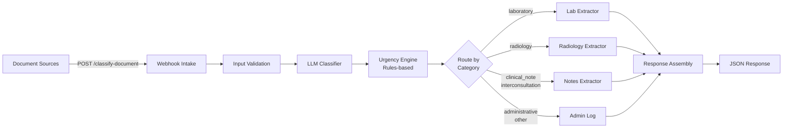
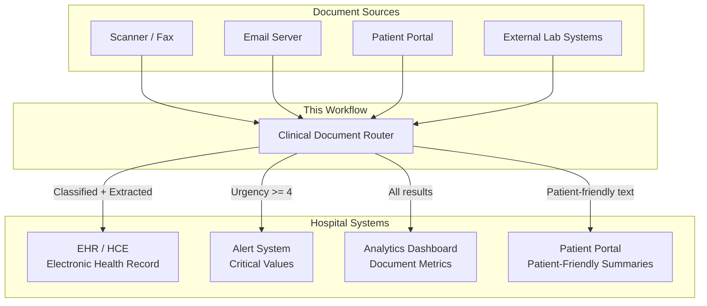

# Architecture

## Pipeline Overview

The Clinical Document Router is a webhook-based microservice that receives unstructured clinical documents and returns structured, classified data.



## Component Details

### 1. Document Intake (Webhook)

- **Method:** POST
- **Path:** `/webhook/classify-document`
- **Body:** `{ "document_text": "...", "source": "scanner|email|portal|unknown" }`
- **Response mode:** Asynchronous (waits for full pipeline to complete)

### 2. Input Validation (Code Node)

- Extracts `document_text` and `source` from request body
- Rejects empty documents with error response
- Adds `received_at` timestamp and `document_length` metadata
- No LLM calls — deterministic validation

### 3. LLM Classifier (LangChain Basic LLM Chain)

- **Model:** Ollama `qwen3:14b` (local, temperature 0)
- **Output:** JSON with `category`, `summary`, `critical_flags`, `language`, `completeness`
- **Categories:** laboratory, radiology, clinical_note, prescription, administrative, interconsultation
- See `prompts/v1/classifier.md` for full prompt documentation

### 4. Urgency Engine (Code Node — Rules-Based)

This is a **deliberate design decision**. Urgency is NOT determined by the LLM.

| Pattern | Urgency | Rationale |
|---------|---------|-----------|
| `VALOR CRÍTICO`, `*** ... ***` | 5 (Critical) | Regex match — deterministic, auditable |
| `** ALTO **`, `** BAJO **` in lab | 3 (Priority) | Regex match on flag markers |
| Radiology reports | 2 (Standard) | Category default |
| Clinical notes, interconsultations | 2 (Standard) | Category default |
| Administrative documents | 1 (Routine) | Category default |
| Non-empty `critical_flags` from LLM | min. 4 | Override — trust LLM detection as secondary signal |

**Why hybrid?** In clinical settings, false negatives on critical values are a patient safety risk. Deterministic regex rules are auditable, predictable, and do not hallucinate. The LLM provides classification expertise; the rules engine provides safety-critical threshold evaluation.

### 5. Category Router (Switch Node)

Routes documents to specialized extraction pipelines:

| Output | Categories | Processing |
|--------|-----------|------------|
| 0 | `laboratory` | Lab-specific extraction (values, units, reference ranges, flags) |
| 1 | `radiology` | Imaging-specific extraction (modality, findings, impression) |
| 2 | `clinical_note`, `interconsultation` | Clinical notes extraction (diagnoses, medications, follow-up) |
| 3 (fallback) | `administrative`, `prescription`, other | Simple metadata logging, no LLM |

### 6. Specialized Extractors (LangChain Basic LLM Chains)

Each extractor uses a domain-specific prompt optimized for its document type:

- **Lab Extractor:** Extracts all test results with values, units, reference ranges, and abnormal flags
- **Radiology Extractor:** Extracts modality, body region, findings (per structure), impression
- **Notes Extractor:** Extracts diagnoses, medications (exact dosages), follow-up instructions, warning signs

All extractors:
- Use `qwen3:14b` at temperature 0 (deterministic extraction)
- Have `continueOnFail: true` (graceful degradation)
- Output validated against JSON schemas in `schemas/`
- Report `data_quality` field for incomplete extractions

### 7. Response Assembly (Code Node)

Consolidates extraction results into a standardized output format:

```json
{
  "status": "success | partial | error",
  "classification": { "category", "urgency", "summary", "language", "completeness" },
  "extracted_data": { ... },
  "patient_friendly_summary": null,
  "alerts": [ { "type", "message", "action", "priority" } ],
  "metadata": { "processed_at", "received_at", "source", "model", "prompt_version", "workflow_version" }
}
```

## Integration Context

### Where This Fits in a Hospital Architecture



### Relevant Interoperability Standards

In a production deployment, this workflow would interface with:

- **IHE XDS.b (Cross-Enterprise Document Sharing):** The classifier output maps to XDS metadata fields (`classCode`, `typeCode`, `confidentialityCode`). Document categories correspond to XDS document class codes.
- **HL7 FHIR:** Extraction outputs conceptually map to FHIR resources:
  - Laboratory → `DiagnosticReport` + `Observation` resources
  - Radiology → `ImagingStudy` + `DiagnosticReport`
  - Discharge notes → `Composition` (discharge summary)
  - Medications → `MedicationRequest`
- **LOINC:** Lab test identification. Sample data references LOINC codes as comments (e.g., `2345-7` for Glucose).
- **SNOMED CT:** Diagnostic coding for clinical notes extraction.

These mappings are documented for reference. The demo workflow outputs generic JSON; a production system would transform these to FHIR Bundle resources.

## Error Handling

| Failure Point | Behavior | Status |
|--------------|----------|--------|
| Empty document | Validation rejects, returns error | `error` |
| LLM classification fails | Defaults to `administrative`, urgency 1 | `partial` |
| LLM extraction fails | `continueOnFail`, returns raw output | `partial` |
| Malformed LLM JSON | Regex extraction + fallback parsing | `partial` or `error` |
| Truncated document | Classified with `completeness: "incomplete"` | `partial` |

## Technology Stack

| Component | Technology | Purpose |
|-----------|-----------|---------|
| Workflow engine | n8n (self-hosted) | Orchestration, routing, webhook management |
| LLM inference | Ollama + qwen3:14b | Local inference, no data exfiltration |
| Language | JavaScript (Code nodes) | Validation, parsing, response assembly |
| Prompt framework | LangChain (n8n integration) | LLM chain management, output parsing |
| Deployment | Docker Compose | Containerized, reproducible environment |
